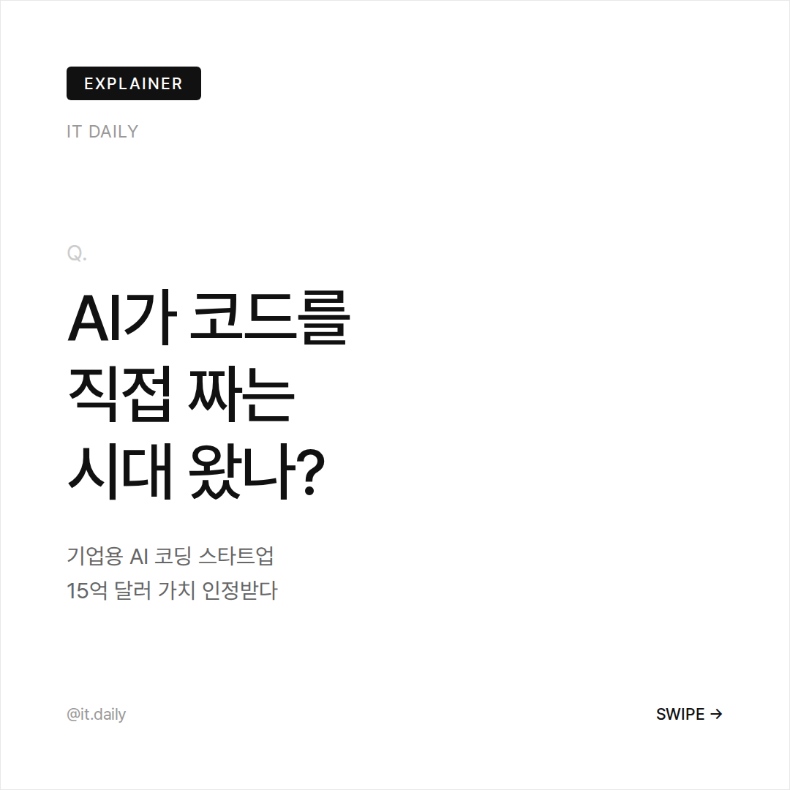
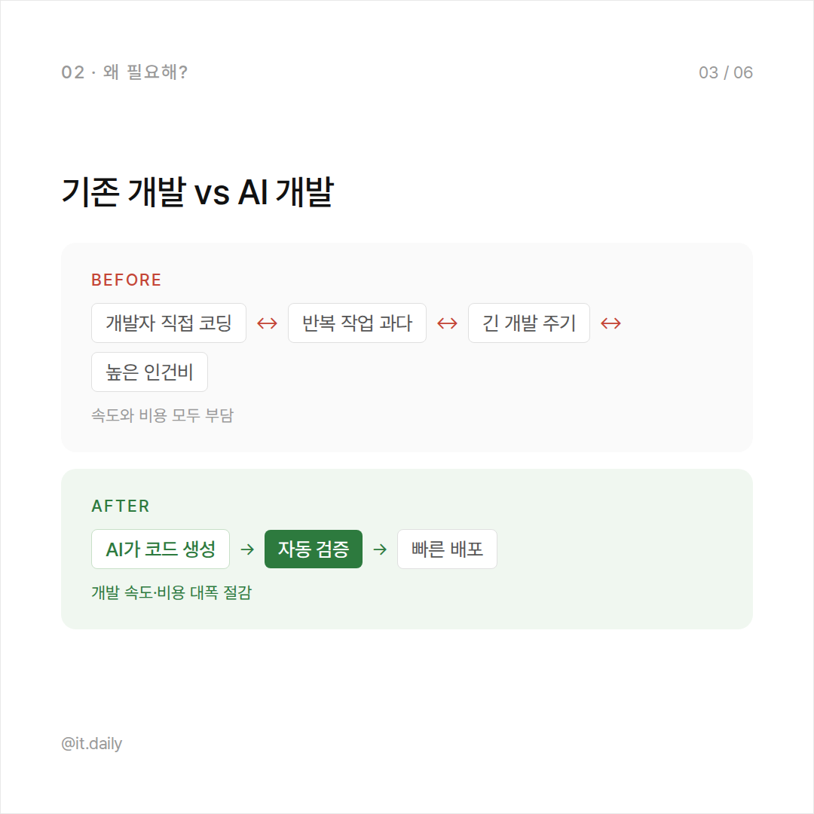

# IT 카드뉴스 자동화

> 매일 오전 9시, Hacker News 상위 기사를 AI가 한국어 카드뉴스로 변환해
> GitHub Pages에 배포하고 Slack으로 알림을 보내는 자동화 파이프라인.


---

## 목차

1. [결과물](#결과물)
2. [파이프라인 흐름](#파이프라인-흐름)
3. [비용 분석](#비용-분석)
4. [기술 선택 이유 및 대안](#기술-선택-이유-및-대안)
5. [파일 구조](#파일-구조)
6. [템플릿 종류](#템플릿-종류)
7. [설치 및 실행](#설치-및-실행)
8. [GitHub Actions 설정](#github-actions-설정)

---

## 결과물

모바일 기준 가로 스와이프 캐러셀. 하단에 핵심 키워드 섹션.

<table>
<tr>
<td></td>
<td></td>
<td></td>
</tr>
</table>

- 카드 **4~8장** (기사 복잡도에 따라 Claude가 자동 결정)
- 뷰어 URL: `https://{username}.github.io/it-news/YYYY-MM-DD.html`

---

## 🔄 파이프라인 흐름

```
[GitHub Actions — 매일 KST 09:00]
         │
         ▼
┌────────────────────────────────────────┐
│  1. 뉴스 수집
│     HN 상위 50개 병렬 조회
│     → 점수순 정렬
│     → 24시간 이내 + IT 키워드 필터
│     → 중복 제거 후 1개 선택
└──────────────────┬─────────────────────┘
                   │
                   ▼
┌────────────────────────────────────────┐
│  2. 카드뉴스 JSON 생성
│     Claude Sonnet API
│     → 8종 템플릿 중 자유 조합
│     → 4~8페이지 구성 + 키워드 3개
└──────────────────┬─────────────────────┘
                   │
                   ▼
┌────────────────────────────────────────┐
│  3. PNG 렌더링
│     Jinja2 → HTML → Playwright
│     → 1080×1080 PNG × N장
└──────────────────┬─────────────────────┘
                   │
                   ▼
┌────────────────────────────────────────┐
│  4. 배포
│     뷰어 HTML + 인덱스 생성
│     → docs/ 커밋 → GitHub Pages
└──────────────────┬─────────────────────┘
                   │
                   ▼
┌────────────────────────────────────────┐
│  5. Slack 알림
│     썸네일 + 링크 → Webhook
└────────────────────────────────────────┘
```

---

## 💰 비용 분석

### 한눈에 보기

| 단계 | 서비스 | 비용 |
|---|---|---|
| 뉴스 수집 | Hacker News API | **무료** |
| AI 생성 | Claude Sonnet API | **≈ $0.03 / 회** |
| 렌더링 | Playwright (로컬/Actions) | **무료** |
| 호스팅 | GitHub Pages | **무료** |
| 스케줄링 | GitHub Actions | **무료** (공개 레포) |
| 알림 | Slack Webhook | **무료** |

### Claude API 상세

```
claude-sonnet-4-6 기준
  Input  ($3.00 / 1M tokens) :  ~2,000 tokens = $0.006
  Output ($15.00 / 1M tokens):  ~1,500 tokens = $0.023
  ───────────────────────────────────────────────────
  1회 합계                              ≈ $0.03

  월간 (30회)   ≈ $0.90
  연간 (365회)  ≈ $10.95
  $5 충전 시    ≈ 166회 (약 5.5개월)
```

> **GitHub Actions 무료 한도**
> 공개 레포 무제한 무료. 비공개 레포는 월 2,000분 (1회 약 3~5분 소요).

---

## 🛠 기술 선택 이유 및 대안

### 1. 뉴스 수집 — Hacker News API ✅

**선택 이유**
- 완전 무료, 인증 불필요
- 커뮤니티 투표로 검증된 기사 품질 (수백~수천 명이 직접 선별)
- 점수 기반 정렬 → "오늘 가장 핫한 IT 기사" 자동 선별
- `time` 필드로 24시간 필터 + 중복 방지 가능

| 대안 | 비용 | 품질 | 비고 |
|---|---|---|---|
| **HN API** ✅ | 무료 | ★★★★★ | 커뮤니티 검증 |
| RSS 멀티피드 | 무료 | ★★★☆☆ | 소스별 편향 가능 |
| NewsAPI | 무료~$449/월 | ★★★★☆ | 무료 플랜은 24시간 딜레이 |
| Google News RSS | 무료 | ★★★☆☆ | 비공식, 불안정 |

---

### 2. AI 생성 — Claude Sonnet API ✅

**선택 이유**
- 한국어 출력 품질이 GPT-4o와 동등하거나 우수
- 긴 System Prompt + 복잡한 JSON 스키마를 정확히 따름
- Opus 대비 5배 저렴, 구조화 출력 품질 동일

| 대안 | 1회 비용 | 한국어 | JSON 정확도 |
|---|---|---|---|
| **Claude Sonnet 4.6** ✅ | ~$0.03 | ★★★★★ | ★★★★★ |
| Claude Opus 4.6 | ~$0.15 | ★★★★★ | ★★★★★ |
| GPT-4o | ~$0.04 | ★★★★★ | ★★★★☆ |
| GPT-4o mini | ~$0.005 | ★★★★☆ | ★★★★☆ |
| Gemini 1.5 Flash | ~$0.002 | ★★★☆☆ | ★★★☆☆ |

---

### 3. 렌더링 — Jinja2 + Playwright ✅

**선택 이유**
- HTML/CSS로 디자인을 코드 레벨에서 완전 제어
- 외부 디자인 API 불필요 → 비용 $0
- 1080×1080 정확한 픽셀 렌더링 (인스타그램 정사각형 규격)
- 템플릿 추가/수정이 HTML 파일 하나로 끝남

| 대안 | 비용 | 디자인 자유도 | 비고 |
|---|---|---|---|
| **Jinja2 + Playwright** ✅ | 무료 | ★★★★★ | HTML/CSS 직접 제어 |
| Puppeteer | 무료 | ★★★★★ | Node.js 기반 |
| Canva API | $13/월~ | ★★★☆☆ | 템플릿 제한 |
| wkhtmltopdf | 무료 | ★★★☆☆ | CSS 지원 불완전 |

---

### 4. 호스팅 — GitHub Pages ✅

**선택 이유**
- 완전 무료 (공개 레포)
- `git push` 한 번으로 자동 배포
- 코드와 결과물을 같은 레포에서 버전 관리

| 대안 | 비용 | 편의성 | 비고 |
|---|---|---|---|
| **GitHub Pages** ✅ | 무료 | ★★★★★ | push = 배포 |
| Vercel | 무료(취미) | ★★★★★ | 더 빠른 CDN |
| Netlify | 무료(취미) | ★★★★★ | 유사 |
| AWS S3 + CloudFront | ~$1/월 | ★★★☆☆ | 설정 복잡 |

---

### 5. 스케줄링 — GitHub Actions ✅

**선택 이유**
- 별도 서버 불필요
- cron 표현식으로 정확한 시간 예약
- 실행 로그 + 실패 알림 기본 제공

| 대안 | 비용 | 비고 |
|---|---|---|
| **GitHub Actions** ✅ | 무료 | 공개 레포 무제한 |
| cron + 개인 서버 | 서버비 | 항상 켜져야 함 |
| AWS Lambda + EventBridge | ~$0/월 | 설정 복잡 |
| Railway / Render | $5~/월 | 간단하지만 유료 |

---

### 6. 알림 — Slack Incoming Webhook ✅

**선택 이유**
- Webhook URL 하나만 발급하면 끝 (토큰 갱신 없음)
- 모바일 앱 푸시 알림 확실
- 썸네일 이미지 자동 표시 + 버튼 클릭으로 바로 뷰어 이동

| 대안 | 설정 난이도 | 푸시 알림 | 비고 |
|---|---|---|---|
| **Slack Webhook** ✅ | ★☆☆☆☆ | 있음 | 토큰 관리 불필요 |
| Telegram Bot | ★☆☆☆☆ | 있음 | 개인용 추천 대안 |
| Discord Webhook | ★☆☆☆☆ | 있음 | 유사 |
| 카카오 나에게 보내기 | ★★★★☆ | 없음 | 토큰 만료 관리 필요 |

---

## 📁 파일 구조

```
it-news/
├── .github/
│   └── workflows/
│       └── daily-news.yml          # 매일 09:00 KST 자동 실행
│
├── design/
│   └── templates/                  # Jinja2 HTML 템플릿 (1080×1080)
│       ├── explainer_01_cover.html
│       ├── explainer_02_definition.html
│       ├── explainer_03_comparison.html
│       ├── explainer_04_process.html
│       ├── explainer_05_example.html
│       ├── explainer_06_conclusion.html
│       ├── explainer_stats.html
│       ├── explainer_timeline.html
│       ├── explainer_faq.html
│       └── explainer_quote.html
│
├── docs/                           # GitHub Pages 루트
│   ├── index.html                  # 날짜별 썸네일 그리드
│   ├── YYYY-MM-DD.html             # 스와이프 뷰어
│   └── YYYY-MM-DD/
│       ├── card_01.png
│       └── card_N.png
│
├── scripts/
│   ├── main.py                     # 파이프라인 오케스트레이션
│   ├── fetch_news.py               # HN API 뉴스 수집
│   ├── claude_processor.py         # Claude API JSON 생성
│   ├── renderer.py                 # HTML → PNG, 뷰어 HTML 생성
│   ├── slack_notify.py             # Slack 알림 전송
│   └── test_render.py              # 로컬 테스트 (API 비용 없음)
│
├── requirements.txt
└── .env.example
```

---

## 🎨 템플릿 종류

Claude가 기사 내용에 따라 11종 중 **4~8장을 자유 조합**.
cover는 항상 1번, conclusion은 항상 마지막.

| 템플릿 | 용도 | 언제 사용 |
|---|---|---|
| `cover` | 표지 — 핵심 고유명사 포함 제목 | 항상 |
| `definition` | 핵심 개념 한 줄 정의 | 새 기술/용어 소개 |
| `comparison` | Before / After 흐름 비교 | 기존 → 새 방식 변화 |
| `process` | 단계별 작동 원리 | "어떻게 작동하나?" |
| `example` | 실제 사례 + LIVE/NEW 태그 | 이미 쓰이는 곳 |
| `stats` | 핵심 수치 3개 대형 강조 | 인상적인 숫자가 있을 때 |
| `timeline` | 날짜별 연대기 | 역사적 흐름·출시 과정 |
| `faq` | Q&A 2~3개 | 독자가 헷갈릴 포인트 |
| `quote` | 핵심 인물 발언 인용 | 임팩트 있는 발언 |
| `pros_cons` | 장점 vs 단점 2열 | 기술·서비스 양면 비교 |
| `impact` | 분야별 파급 효과 | 큰 발표의 영역별 영향 |
| `myth_fact` | 오해(MYTH) vs 사실(FACT) | 잘못 알려진 정보 정정 |
| `conclusion` | 한 줄 요약 마무리 | 항상 |

---

## 🚀 설치 및 실행

### 로컬 테스트 (API 비용 없음)

```bash
pip install -r requirements.txt
playwright install chromium

cd scripts
python test_render.py        # 목 데이터로 PNG + 뷰어 생성
open ../docs/_test.html      # 브라우저에서 확인
```

### 전체 파이프라인 실행

```bash
cp .env.example .env
# .env에 ANTHROPIC_API_KEY 입력

cd scripts
python main.py
```

---

## ⚙️ GitHub Actions 설정

### 필요한 Secrets

레포 → **Settings → Secrets and variables → Actions**

| Secret | 값 | 발급 방법 |
|---|---|---|
| `ANTHROPIC_API_KEY` | `sk-ant-...` | [console.anthropic.com](https://console.anthropic.com) |
| `SLACK_WEBHOOK_URL` | `https://hooks.slack.com/...` | Slack 앱 → Incoming Webhooks |
| `GH_REPO` | `username/it-news` | 직접 입력 |

### 실행 시간 변경

`.github/workflows/daily-news.yml` cron 수정:

```yaml
- cron: '0 0 * * *'    # UTC 00:00 = KST 09:00  ← 현재
- cron: '0 22 * * *'   # UTC 22:00 = KST 07:00
- cron: '0 2 * * *'    # UTC 02:00 = KST 11:00
```
